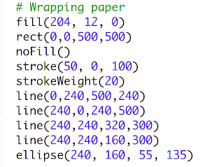
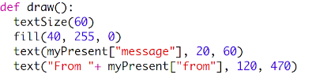
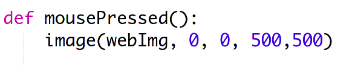

# CodeClub Project 

## Christmas Present Exchange

In this project, we will make a wrapped present and then reveal the gift underneath. We will then create and send presents to each other!

This project uses the PyProcessing library rather than Turtle for making screen pictures. You can see a reference to the ways we can draw here: [https://py.processing.org/reference/](https://py.processing.org/reference/). Processing has a function to set up the screen, then one to update it within a loop, allowing animation etc.

1. Go to the starting project : [https://trinket.io/python/e8dc6e40d0](https://trinket.io/python/e8dc6e40d0). See we have a python "dictionary" for holding the data about the present. 

2. Let's start with the wrapping paper. We want to add code to the setup function at line 13. 

3. Test the program by running it. Notice that the run() function means that the program keeps running until we click Stop.

4. The "fill" function is the RGB (Red, green and blue) values we have worked with before, which go from 0 to 255. Try changing the values and changing your wrapping paper.

5. Let's add some Text to the gift. We can add the draw() function in between setup() and run() to do this. See that the function is using the text from our Dictionary at the top.

6. Hit Run to test. Again, note that you can change the size, colour and position of the text by changing the numbers.

7. Now for the present! We need to load an image in the setup() function using the URL (web link) in the Dictionary.

8. We won't see anything yet, but we will reveal the present on a mouse click, with a new function:

